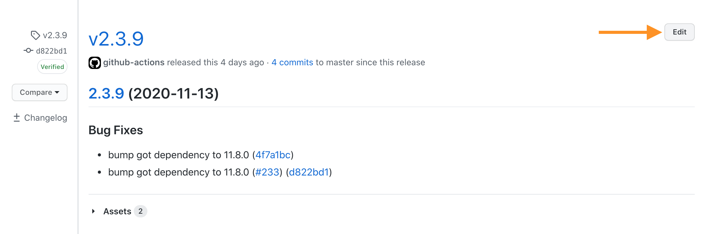
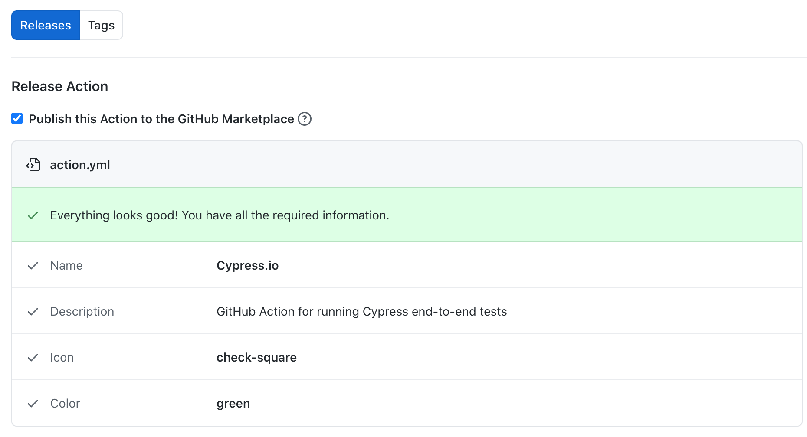
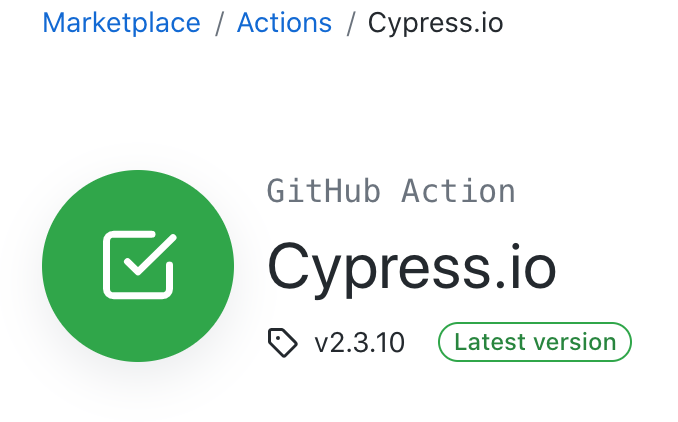

# Contributing to cypress-io/github-action

Thanks for taking the time to contribute! :smile:

*To contribute to the main Cypress product, please read the related [CONTRIBUTING](https://github.com/cypress-io/cypress/blob/develop/CONTRIBUTING.md) document, which also contains useful general tips.*

To contribute to the [cypress-io/github-action](https://github.com/cypress-io/github-action) repository, please continue reading here.

## Code of Conduct

All contributors are expected to abide by our [Code of Conduct](./CODE_OF_CONDUCT.md).

## Development

This document describes topics useful to contributors to this repository. The repository's purpose is to provide a GitHub JavaScript action which is published to:

1. GitHub's Marketplace as [cypress-io/github-action](https://github.com/marketplace/actions/cypress-io#cypress-iogithub-action--)
2. npm's JavaScript Package Registry as [@cypress/github-action](https://www.npmjs.com/package/@cypress/github-action)


You can read the GitHub document [Creating a JavaScript action](https://docs.github.com/en/actions/creating-actions/creating-a-javascript-action) for background information on how JavaScript actions for GitHub are created and how they work.

### Providing fixes or features

If you are submitting a Pull Request (PR) to provide a fix or feature for the action, the following is relevant to you:

The main source code elements for the action are:
- [action.yml](action.yml)
- [index.js](index.js)
- [src/ping.js](src/ping.js)

The action runs from the [dist](dist) directory, which requires a `build` step to set up. This step uses [@vercel/ncc](https://github.com/vercel/ncc) to compile the code and modules into one file used for distribution.

To contribute changes, follow these instructions in the order given below:

1. If you are a new external contributor, then first fork the repository (see GitHub documentation [About forks](https://docs.github.com/en/pull-requests/collaborating-with-pull-requests/working-with-forks/about-forks)).
1. Create a new branch with a meaningful name e.g. `fix/my-bug` based on the current `master` branch.
1. Make the necessary source code changes, including additions or changes to the [README.md](./README.md) documentation if parameters are added or affected.
1. Ensure you have [`Node.js`](https://nodejs.org/en/) installed. (See the root [.node-version](.node-version) file for the required version. You can find a list of tools on [node-version-usage](https://github.com/shadowspawn/node-version-usage) to switch the version of [`Node.js`](https://nodejs.org/en/) based on [.node-version](.node-version)).
1. Execute the following in the root directory of the cloned repository

    ```bash
    npm install
    npm run format
    npm run build
    ```

1. Commit the change. (If you are working on Microsoft Windows, see [Windows users](#windows-users) below.)
1. Push to the repository.
1. If you are working in a fork, ensure actions are enabled.
1. Refer to [Manually running a workflow](https://docs.github.com/en/actions/managing-workflow-runs/manually-running-a-workflow) to use this to test any particular workflow affected by your change.
1. Open a draft PR with a title which starts with `fix:` or `feat:` if a new release should be triggered by the PR. For more details on the release process, see the section [Merging pull requests](#merging-pull-requests) below.
1. Note that first-time submitters must sign the CLA agreement and be approved to run workflows.
1. Check that all tests which are triggered by the PR were either successful or were skipped.
1. If the PR is showing that the tests were successful mark the PR as Ready for Review.

#### Windows users

The repository is set up with a `git` / `Husky` pre-commit hook which ensures that any changes to the core source files are formatted and built consistently before they are committed. This does not work well with [GitHub Desktop](https://docs.github.com/en/desktop). You can disable this function by setting an environment variable `HUSKY=0`. If you do this and then omit to use `npm run format` / `npm run build` before you commit any changes affecting the core source files, you will find that checks fail when you submit a PR. In this case you should run the `format` and `build` commands and amend your commit.

### Adding a new example

1. If you are creating a new example, add this as a new project in the `examples` directory. An example project is a regular npm package with its own `package.json` and Cypress dev dependency. (Note: Legacy `examples/v9` should not be extended.)
1. Add a corresponding `.github/workflows` YAML file that uses this action and runs using your new `examples/X` through the `working-directory` parameter. The example should demonstrate any new feature.
1. Add a workflow status badge to the [README.md](README.md) file (see [Adding a workflow status badge](https://docs.github.com/en/actions/monitoring-and-troubleshooting-workflows/adding-a-workflow-status-badge)), like the following:

[](.github/workflows/example-chrome.yml)

### External Testing

The example workflows in [.github/workflows](./.github/workflows) specify

`uses: ./`

which calls the action code from the branch they are running in when the workflow is run directly in the repository here.

From another (external) repository, the production version of the action is called with

```yaml
- uses: cypress-io/github-action@v5
```

To test out a branch in development calling it from another repository, replace `v5` by the name of your branch. If your branch is in a fork, then also replace `cypress-io` by your own GitHub username in the form:

`- uses: <your-username>/github-action@<your-branch>`

## Merging pull requests

This information is for Cypress.io Members or Collaborators who merge pull requests:

1. When merging a pull request, use the [Squash and merge](https://docs.github.com/en/repositories/configuring-branches-and-merges-in-your-repository/configuring-pull-request-merges/about-merge-methods-on-github#squashing-your-merge-commits) option to squash all commits into one.
1. Make sure the commit subject and body follow [semantic commit convention](https://semantic-release.gitbook.io/semantic-release/#commit-message-format), for instance:

    ```text
    feat: added new parameter
    fix: fixed a bug
    ```

    If you need to bump the major version, mark it as breaking change in the body of the commit's message like:

    ```text
    fix: upgrade dependency X

    BREAKING CHANGE: requires minimum Node.js 16 to run
    ```

1. New versions of this action will be released automatically by the CI when merged to the `master` branch, see [.github/workflows/main.yml](.github/workflows/main.yml). This will create a new [GitHub release](https://github.com/cypress-io/github-action/releases) and will update the current `v5` branch. Thus specifying `uses: cypress-io/github-action@v5` selects the new version automatically. This **will not** push the latest release to GitHub Marketplace.
1. The action's CI is configured to use the [default Angular release rules](https://github.com/semantic-release/commit-analyzer/blob/master/lib/default-release-rules.js). This means that only `feat:`, `fix:` and `perf:` trigger a new release which is then logged to the [releases](https://github.com/cypress-io/github-action/releases) page. Other Angular commit types listed on [Contributing to Angular](https://github.com/angular/angular/blob/main/CONTRIBUTING.md#-commit-message-format) can be used for documentation purposes, however they are ignored by the currently configured release process.

## GitHub Marketplace publication

Publishing a new release to the GitHub Marketplace is a manual process.

After a new release has been created, go to the release and click "Edit"



Review the release info, make sure the "publish ..." checkbox is checked



After clicking "Update the release" check that the Marketplace [https://github.com/marketplace/actions/cypress-io](https://github.com/marketplace/actions/cypress-io) has been updated.



See also [Publishing actions in GitHub Marketplace](https://docs.github.com/en/actions/creating-actions/publishing-actions-in-github-marketplace).
