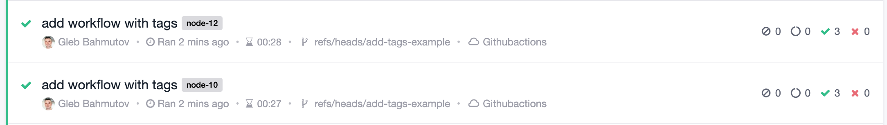
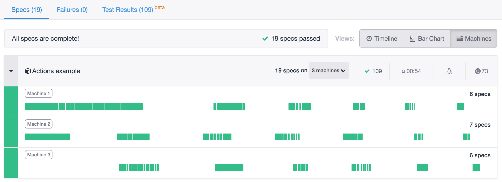

# cypress-io/github-action [![renovate-app badge][renovate-badge]][renovate-app] [](https://github.com/cypress-io/github-action/actions)

> [GitHub Action](https://help.github.com/en/actions) for running [Cypress](https://www.cypress.io) end-to-end tests. Includes NPM installation, custom caching and lots of configuration options.

## Examples

- [Cypress 10](#cypress-10)
- [Basic](#basic)
- [Explicit version](#explicit-version)
- Run tests in a given [browser](#browser)
  - using [Firefox](#firefox)
  - using [Edge](#edge)
  - using [headless mode](#headless)
- Using [Docker image](#docker-image)
- Specify [environment variables](#env)
- Run only some [spec files](#specs)
- Test [project in subfolder](#project)
- [Record results](#record-test-results-on-cypress-dashboard) on Cypress Dashboard
- Tag [recordings](#tag-recordings)
- [Quiet output](#quiet-flag)
- Store [test artifacts](#artifacts) on GitHub
- Set Cypress [config values](#config)
- Use specific [config file](#config-file)
- Run tests in [parallel](#parallel)
- Run E2E and [Component tests](#component-tests)
- [Build app](#build-app) before running the tests
- [Start server](#start-server) before running the tests
- [Start multiple servers](#start-multiple-servers) before running the tests
- [Wait for server](#wait-on) to respond before running the tests
- use [custom install command](#custom-install-command)
- use [command prefix](#command-prefix)
- use [own custom test command](#custom-test-command)
- pass [custom build id](#custom-build-id) when recording to Dashboard
- generate a [robust custom build id](#robust-custom-build-id) to allow re-running the workflow
- use different [working-directory](#working-directory)
- use [custom cache key](#custom-cache-key)
- run tests on multiple [Node versions](#node-versions)
- split [install and tests](#split-install-and-tests) into separate jobs
- use [custom install commands](#custom-install)
- install [only Cypress](#install-cypress-only) to avoid installing all dependencies
- [timeouts](#timeouts) to avoid hanging CI jobs
- [print Cypress info](#print-cypress-info) like detected browsers
- [run tests nightly](#nightly-tests) or on any schedule
- [more examples](#more-examples)

### Cypress configuration from v9 to v10

Cypress 10 no longer uses a `cypress.json` configuration file. Instead, it now uses a `cypress.config.js` file. This GitHub Action's default Cypress configuration file is now `cypress.config.js`.

#### Cypress 9 and earlier

If you are using an earlier version of Cypress, you will need to added `config-file: cypress.json` like so:

```yml
name: End-to-end tests
on: [push]
jobs:
  cypress-run:
    runs-on: ubuntu-20.04
    steps:
      - name: Checkout
        uses: actions/checkout@v2
      # Install NPM dependencies, cache them correctly
      # and run all Cypress tests
      - name: Cypress run
        uses: cypress-io/github-action@v4
        with:
          config-file: cypress.json
```

### Basic

```yml
name: End-to-end tests
on: [push]
jobs:
  cypress-run:
    runs-on: ubuntu-20.04
    steps:
      - name: Checkout
        uses: actions/checkout@v2
      # Install NPM dependencies, cache them correctly
      # and run all Cypress tests
      - name: Cypress run
        uses: cypress-io/github-action@v4
```

[](.github/workflows/example-basic.yml)

The workflow file [.github/workflows/example-basic.yml](.github/workflows/example-basic.yml) shows how Cypress runs on GH Actions using Ubuntu (16, 18, or 20), on Windows, and on Mac without additional OS dependencies necessary.

**Note:** this package assumes that `cypress` is declared as a development dependency in the `package.json` file. The `cypress` NPM module is required to run Cypress via its [NPM module API](https://on.cypress.io/module-api).

### Explicit version

**Best practice:**

Our examples specify the tag of the action to use listing only the major version `@v2`

```yml
- name: Cypress run
  uses: cypress-io/github-action@v4
```

When using `cypress-io/github-action@v4` from your workflow file, you automatically will be using the latest [tagged version from this repository](https://github.com/cypress-io/github-action/tags). If you want to precisely control the version of this module, use the full tag version, for example:

```yml
- name: Cypress run
  uses: cypress-io/github-action@v4.x.x
```

By using the full version tag, you will avoid accidentally using a newer version of the action.

### Browser

Specify the browser name or path with `browser` parameter

```yml
name: E2E on Chrome
on: [push]
jobs:
  cypress-run:
    runs-on: ubuntu-20.04
    # let's make sure our tests pass on Chrome browser
    name: E2E on Chrome
    steps:
      - uses: actions/checkout@v2
      - uses: cypress-io/github-action@v4
        with:
          browser: chrome
```

[](.github/workflows/example-chrome.yml)

### Firefox

In order to run Firefox, you need to use non-root user (Firefox security restriction).

```yml
name: Firefox
on: push
jobs:
  firefox:
    runs-on: ubuntu-latest
    container:
      image: cypress/browsers:node12.16.1-chrome80-ff73
      options: --user 1001
    steps:
      - uses: actions/checkout@v2
      - uses: cypress-io/github-action@v4
        with:
          browser: firefox
```

[](.github/workflows/example-firefox.yml)

**Note:** the magical user id `1001` works because it matches permissions settings on the home folder, see issue [#104](https://github.com/cypress-io/github-action/issues/104)

### Edge

```yml
name: Edge
on: push
jobs:
  tests:
    runs-on: windows-latest
    steps:
      - uses: actions/checkout@v2
      - uses: cypress-io/github-action@v4
        with:
          browser: edge
```

[](.github/workflows/example-edge.yml)

**Note:** Microsoft has not released Edge for Linux yet, thus you need to run these tests on Windows or Mac runners with Edge preinstalled. You can use [`cypress info`](https://on.cypress.io/command-line#cypress-info) command to see the browsers installed on the machine.

### Headless

Run the browser in headless mode

```yml
name: Chrome headless
on: [push]
jobs:
  cypress-run:
    runs-on: ubuntu-20.04
    steps:
      - uses: actions/checkout@v2
      - uses: cypress-io/github-action@v4
        with:
          browser: chrome
          headless: true
```

### Docker image

You can run tests in a GH Action in your Docker container.

```yml
name: E2E in custom container
on: [push]
jobs:
  cypress-run:
    runs-on: ubuntu-20.04
    # Cypress Docker image with Chrome v78
    # and Firefox v70 pre-installed
    container: cypress/browsers:node12.13.0-chrome78-ff70
    steps:
      - uses: actions/checkout@v2
      - uses: cypress-io/github-action@v4
        with:
          browser: chrome
```

### Env

Specify the env argument with `env` parameter

```yml
name: Cypress tests
on: [push]
jobs:
  cypress-run:
    runs-on: ubuntu-20.04
    steps:
      - name: Checkout
        uses: actions/checkout@v2

      - name: Cypress run with env
        uses: cypress-io/github-action@v4
        with:
          env: host=api.dev.local,port=4222
```

When passing the environment variables this way, unfortunately due to GitHub Actions syntax, the variables should be listed in a single line, which can be hard to read. As an alternative, you can use the step's `env` block where every variable can be set on its own line. In this case, you should prefix every variable with `CYPRESS_` because such variables [are loaded by Cypress automatically](https://on.cypress.io/environment-variables). The above code example is equivalent to:

```yml
name: Cypress tests
on: [push]
jobs:
  cypress-run:
    runs-on: ubuntu-20.04
    steps:
      - name: Checkout
        uses: actions/checkout@v2

      - name: Cypress run with env
        uses: cypress-io/github-action@v4
        env:
          CYPRESS_host: api.dev.local
          CYPRESS_port: 4222
```

For more examples, see the workflow example below.

[](.github/workflows/example-env.yml)

### Specs

Specify the [spec files to run](https://docs.cypress.io/guides/guides/command-line.html#cypress-run-spec-lt-spec-gt) with `spec` parameter

```yml
name: Cypress tests
on: [push]
jobs:
  cypress-run:
    name: Cypress run
    runs-on: ubuntu-20.04
    steps:
      - name: Checkout
        uses: actions/checkout@v2

      - name: Cypress run
        uses: cypress-io/github-action@v4
        with:
          spec: cypress/integration/spec1.js
```

You can pass multiple multiple specs and wild card patterns using multi-line parameter, see [example-config.yml](./.github/workflows/example-config.yml):

```yml
spec: |
  cypress/integration/spec-a.js
  cypress/**/*-b.js
```

For more information, visit [the Cypress command-line docs](https://on.cypress.io/command-line#cypress-run-env-lt-env-gt).

### Project

Specify the [project to run](https://docs.cypress.io/guides/guides/command-line.html#cypress-run-project-lt-project-path-gt) with `project` parameter

```yml
name: Cypress tests
on: [push]
jobs:
  cypress-run:
    name: Cypress run
    runs-on: ubuntu-20.04
    steps:
      - name: Checkout
        uses: actions/checkout@v2
      - name: Cypress run
        uses: cypress-io/github-action@v4
        with:
          project: ./some/nested/folder
```

For more information, visit [the Cypress command-line docs](https://on.cypress.io/command-line#cypress-run-project-lt-project-path-gt).

### Record test results on Cypress Dashboard

```yml
name: Cypress tests
on: [push]
jobs:
  cypress-run:
    name: Cypress run
    runs-on: ubuntu-20.04
    steps:
      - name: Checkout
        uses: actions/checkout@v2

      - name: Cypress run
        uses: cypress-io/github-action@v4
        with:
          record: true
        env:
          # pass the Dashboard record key as an environment variable
          CYPRESS_RECORD_KEY: ${{ secrets.CYPRESS_RECORD_KEY }}
          # pass GitHub token to allow accurately detecting a build vs a re-run build
          GITHUB_TOKEN: ${{ secrets.GITHUB_TOKEN }}
```

[](.github/workflows/example-recording.yml)

**Tip 1:** We recommend using the action with `on: [push]` instead of `on: [pull_request]` to get the most accurate information related to the commit on the dashboard. With pull requests, the merge commit is created automatically and might not correspond to a meaningful commit in the repository.

**Tip 2:** we recommend passing the `GITHUB_TOKEN` secret (created by the GH Action automatically) as an environment variable. This will allow correctly identifying every build and avoid confusion when re-running a build.

**Tip 3:** if running on `pull_request` event, the commit message is "merge SHA into SHA", which is not what you want probably. You can overwrite the commit message sent to the Dashboard by setting an environment variable. See [issue 124](https://github.com/cypress-io/github-action/issues/124#issuecomment-653180260) for details.

**Tip 4:** to record the project needs `projectId`. Typically this value is saved in the `cypress.json` file. If you want to avoid this, pass the project id using an environment variable:

```yml
name: Cypress tests
on: [push]
jobs:
  cypress-run:
    name: Cypress run
    runs-on: ubuntu-20.04
    steps:
      - name: Checkout
        uses: actions/checkout@v2

      - name: Cypress run
        uses: cypress-io/github-action@v4
        with:
          record: true
        env:
          # pass the Dashboard record key as an environment variable
          CYPRESS_RECORD_KEY: ${{ secrets.CYPRESS_RECORD_KEY }}
          # pass GitHub token to allow accurately detecting a build vs a re-run build
          GITHUB_TOKEN: ${{ secrets.GITHUB_TOKEN }}
          # pass the project ID from the secrets through environment variable
          CYPRESS_PROJECT_ID: ${{ secrets.PROJECT_ID }}
```

### Quiet flag

You can provide `quiet` flag for cypress run to silence any Cypress specific output from stdout

```yml
name: example-quiet
on: [push]
jobs:
  cypress-run:
    runs-on: ubuntu-latest
    steps:
      - name: Checkout
        uses: actions/checkout@v2
      # Install NPM dependencies, cache them correctly
      # and run all Cypress tests with `quiet` parameter
      - name: Cypress run
        uses: ./
        with:
          working-directory: examples/quiet
          quiet: true
```

[](.github/workflows/example-quiet.yml)

### Tag recordings

You can pass a single or multiple tags when recording a run. For example

```yml
name: tags
on: [push]
jobs:
  cypress-run:
    runs-on: ubuntu-latest
    # let's make sure our "app" works on several versions of Node
    strategy:
      matrix:
        node: [10, 12]
    name: E2E on Node v${{ matrix.node }}
    steps:
      - name: Setup Node
        uses: actions/setup-node@v1
        with:
          node-version: ${{ matrix.node }}
      - run: node -v

      - name: Checkout
        uses: actions/checkout@v2

      - name: Cypress run
        uses: cypress-io/github-action@v4
        with:
          record: true
          tag: node-${{ matrix.node }}
        env:
          CYPRESS_RECORD_KEY: ${{ secrets.CYPRESS_RECORD_KEY }}
          GITHUB_TOKEN: ${{ secrets.GITHUB_TOKEN }}
```

The recording will have tags as labels on the run.



You can pass multiple tags using commas like `tag: node-10,nightly,staging`.

### Artifacts

If you don't record the test run on Cypress Dashboard, you can still store generated videos and screenshots as CI artifacts. See [cypress-gh-action-example](https://github.com/bahmutov/cypress-gh-action-example) and the workflow example below

```yml
name: Artifacts
on: [push]
jobs:
  cypress-run:
    runs-on: ubuntu-20.04
    name: Artifacts
    steps:
      - uses: actions/checkout@v2
      - uses: cypress-io/github-action@v4
      # after the test run completes
      # store videos and any screenshots
      # NOTE: screenshots will be generated only if E2E test failed
      # thus we store screenshots only on failures
      # Alternative: create and commit an empty cypress/screenshots folder
      # to always have something to upload
      - uses: actions/upload-artifact@v2
        if: failure()
        with:
          name: cypress-screenshots
          path: cypress/screenshots
      # Test run video was always captured, so this action uses "always()" condition
      - uses: actions/upload-artifact@v2
        if: always()
        with:
          name: cypress-videos
          path: cypress/videos
```

### Config

Specify [configuration](https://docs.cypress.io/guides/references/configuration.html) values with `config` parameter

```yml
name: Cypress tests
on: [push]
jobs:
  cypress-run:
    name: Cypress run
    runs-on: ubuntu-20.04
    steps:
      - name: Checkout
        uses: actions/checkout@v2

      - name: Cypress run
        uses: cypress-io/github-action@v4
        with:
          config: pageLoadTimeout=100000,baseUrl=http://localhost:3000
```

[](.github/workflows/example-config.yml)

### Config File

Specify the path to your config file with `config-file` parameter

```yml
name: Cypress tests
on: [push]
jobs:
  cypress-run:
    name: Cypress run
    runs-on: ubuntu-20.04
    steps:
      - name: Checkout
        uses: actions/checkout@v2

      - name: Cypress run
        uses: cypress-io/github-action@v4
        with:
          config-file: tests/cypress-config.json
```

### Parallel

**Note:** Cypress parallelization requires [Cypress Dashboard](https://on.cypress.io/dashboard-introduction) account.

You can spin multiple containers running in parallel using `strategy: matrix` argument. Just add more dummy items to the `containers: [1, 2, ...]` array to spin more free or paid containers. Then use `record` and `parallel` parameters to [load balance tests](https://on.cypress.io/parallelization)

```yml
name: Parallel Cypress Tests

on: [push]

jobs:
  test:
    name: Cypress run
    runs-on: ubuntu-20.04
    strategy:
      # when one test fails, DO NOT cancel the other
      # containers, because this will kill Cypress processes
      # leaving the Dashboard hanging ...
      # https://github.com/cypress-io/github-action/issues/48
      fail-fast: false
      matrix:
        # run 3 copies of the current job in parallel
        containers: [1, 2, 3]
    steps:
      - name: Checkout
        uses: actions/checkout@v2

      # because of "record" and "parallel" parameters
      # these containers will load balance all found tests among themselves
      - name: Cypress run
        uses: cypress-io/github-action@v4
        with:
          record: true
          parallel: true
          group: 'Actions example'
        env:
          # pass the Dashboard record key as an environment variable
          CYPRESS_RECORD_KEY: ${{ secrets.CYPRESS_RECORD_KEY }}
          # Recommended: pass the GitHub token lets this action correctly
          # determine the unique run id necessary to re-run the checks
          GITHUB_TOKEN: ${{ secrets.GITHUB_TOKEN }}
```



**Warning ⚠️:** Cypress actions use `GITHUB_TOKEN` to get the correct branch and the number of jobs run, making it possible to re-run without the need of pushing an empty commit. If you don't want to use the `GITHUB_TOKEN` you can still run your tests without problem with the only note that Cypress Dashboard API connects parallel jobs into a single logical run using GitHub commit SHA plus workflow name. If you attempt to re-run GitHub checks, the Dashboard thinks the run has already ended. In order to truly rerun parallel jobs, push an empty commit with `git commit --allow-empty -m "re-run checks" && git push`. As another work around you can generate and cache a custom build id, read [Adding a unique build number to GitHub Actions](https://medium.com/attest-engineering/adding-a-unique-github-build-identifier-7aa2e83cadca)

The Cypress GH Action does not spawn or create any additional containers - it only links the multiple containers spawned using the matrix strategy into a single logical Dashboard run and into splitting the specs amongst the machines. See the [Cypress parallelization](https://on.cypress.io/parallelization) guide for the explanation.

### Component tests

You can run [Cypress component tests](https://on.cypress.io/component-testing) in a job separate from E2E tests by adding `component: true`:

```yml
- name: Run E2E tests 🧪
  uses: cypress-io/github-action@v4

- name: Run Component tests 🧪
  uses: cypress-io/github-action@v4
  with:
    # we have already installed everything
    install: false
    # to run component tests we need to use "component: true"
    component: true
```

See the example project [component-test](/examples/v10/component-tests/) and the [example-component-test-workflow](.github/workflows/example-component-test.yml) for more details.

### Build app

You can run a build step before starting tests

```yml
name: Build
on: [push]
jobs:
  cypress-run:
    runs-on: ubuntu-20.04
    steps:
      - name: Checkout
        uses: actions/checkout@v2
      - name: Cypress run
        uses: cypress-io/github-action@v4
        with:
          build: npm run build
```

### Start server

If your tests run against a local server, use `start` parameter, the server will run in the background and will shut down after tests complete

```yml
name: With server
on: [push]
jobs:
  cypress-run:
    runs-on: ubuntu-20.04
    steps:
      - name: Checkout
        uses: actions/checkout@v2
      - name: Cypress run
        uses: cypress-io/github-action@v4
        with:
          start: npm start
```

**Note:** sometimes on Windows you need to run a different start command. You can use `start-windows` parameter for this

```yml
name: With server
on: [push]
jobs:
  cypress-run:
    runs-on: ubuntu-20.04
    steps:
      - name: Checkout
        uses: actions/checkout@v2
      - name: Cypress run
        uses: cypress-io/github-action@v4
        with:
          # Linux and MacOS
          start: npm start
          # Takes precedences on Windows
          start-windows: npm run start:windows:server
```

[](.github/workflows/example-start.yml)

**Note:** GitHub cleans up the running server processes automatically. This action does not stop them.

### Start multiple servers

You can start multiple server processes. For example, if you have an API to start using `npm run api` and the web server to start using `npm run web` you can put those commands in `start` using comma separation.

```yml
name: With servers
on: [push]
jobs:
  cypress-run:
    runs-on: ubuntu-18.04
    steps:
      - name: Checkout
        uses: actions/checkout@v2
      - name: Cypress run
        uses: cypress-io/github-action@v4
        with:
          start: npm run api, npm run web
```

You can place the start commands in separate lines

```yml
with:
  start: |
    npm run api
    npm run web
```

[](.github/workflows/example-start.yml)

### Wait-on

If you are starting a local server and it takes a while to start, you can add a parameter `wait-on` and pass url to wait for the server to respond.

```yml
name: After server responds
on: [push]
jobs:
  cypress-run:
    runs-on: ubuntu-20.04
    steps:
      - name: Checkout
        uses: actions/checkout@v2
      - name: Cypress run
        uses: cypress-io/github-action@v4
        with:
          start: npm start
          # quote the url to be safe against YML parsing surprises
          wait-on: 'http://localhost:8080'
```

[](.github/workflows/example-wait-on.yml)

By default, `wait-on` will retry for 60 seconds. You can pass a custom timeout in seconds using `wait-on-timeout`.

```yml
- uses: cypress-io/github-action@v4
  with:
    start: npm start
    wait-on: 'http://localhost:8080/status'
    # wait for 2 minutes for the server to respond
    wait-on-timeout: 120
```

See also [](.github/workflows/example-webpack.yml)

You can wait for multiple URLs to respond by separating urls with a comma

```yml
- uses: cypress-io/github-action@v4
  with:
    # API runs on port 3050
    # Web server runs on port 8080
    start: npm run api, npm run web
    # wait for all services to respond
    wait-on: 'http://localhost:3050, http://localhost:8080'
```

The action will wait for the first url to respond, then will check the second url, and so on.

You can even use your own command (usually by using `npm`, `yarn`, `npx`) to wait for the server to respond. For example, if you want to use [wait-on](https://github.com/jeffbski/wait-on) utility to ping the server and run the Cypress tests after the server responds:

```yml
- uses: cypress-io/github-action@v4
  with:
    start: npm start
    wait-on: 'npx wait-on --timeout 5000 http://localhost:3000'
```

See [example-wait-on.yml](.github/workflows/example-wait-on.yml) workflow file.

If this action times out waiting for the server to respond, please see [Debugging](#debugging) section in this README file.

### Custom install command

If you want to overwrite the install command

```yml
- uses: cypress-io/github-action@v4
  with:
    install-command: yarn --frozen-lockfile --silent
```

See [example-install-command.yml](.github/workflows/example-install-command.yml) workflow file.

### Command prefix

You can prefix the default test command using the `command-prefix` option. This is useful for example when running [Percy](https://docs.percy.io/docs/cypress), which requires the test command to be wrapped with `percy exec --`.

```yml
name: Visual
on: [push]
jobs:
  e2e:
    runs-on: ubuntu-20.04
    steps:
      - name: Checkout
        uses: actions/checkout@v2
      - name: Cypress run
        uses: cypress-io/github-action@v4
        with:
          start: npm start
          # quote the url to be safe against YML parsing surprises
          wait-on: 'http://localhost:8080'
          # the entire command will automatically be prefixed with "npm"
          # and we need the second "npm" to execute "cypress run ..." command line
          command-prefix: 'percy exec -- npx'
```

See live example [angular-pizza-creator](https://github.com/cypress-io/angular-pizza-creator).

### Custom test command

You can overwrite the Cypress run command with your own

```yml
steps:
  - name: Checkout 🛎
    uses: actions/checkout@v2

  - name: Custom tests 🧪
    uses: cypress-io/github-action@v4
    with:
      command: npm run e2e:ci
```

See [.github/workflows/example-custom-command.yml](.github/workflows/example-custom-command.yml) file.

### Custom build id

You can overwrite [`ci-build-id`](https://on.cypress.io/parallelization#Linking-CI-machines-for-parallelization-or-grouping) used to link separate machines running tests into a single parallel run.

```yml
name: Parallel
on: [push]
jobs:
  test:
    runs-on: ubuntu-20.04
    strategy:
      matrix:
        # run 3 copies of the current job in parallel
        containers: [1, 2, 3]
    steps:
      - uses: actions/checkout@v2
      - uses: cypress-io/github-action@v4
        with:
          record: true
          parallel: true
          group: 'Actions example'
          ci-build-id: '${{ github.sha }}-${{ github.workflow }}-${{ github.event_name }}'
        env:
          # pass the Dashboard record key as an environment variable
          CYPRESS_RECORD_KEY: ${{ secrets.CYPRESS_RECORD_KEY }}
          GITHUB_TOKEN: ${{ secrets.GITHUB_TOKEN }}
```

**Tip:** see GitHub Actions [environment variables](https://help.github.com/en/actions/automating-your-workflow-with-github-actions/using-environment-variables) and [expression syntax](https://help.github.com/en/actions/automating-your-workflow-with-github-actions/contexts-and-expression-syntax-for-github-actions).

### Robust custom build id

If you re-run the GitHub workflow, if you use the same custom build id during recording, the Dashboard will cancel the run with "Build already finished" error. To avoid this, you need to generate a _new_ custom build id on every workflow re-run. A good solution showing in the [example-custom-ci-build-id.yml](./.github/workflows/example-custom-ci-build-id.yml) file is to run a common job first that just generates a new random ID. This ID can be used by the testing jobs to tie the build together. If the user re-runs the workflow a new unique build id is generated, allowing recording the new Dashboard run.

```yml
jobs:
  # single job that generates and outputs a common id
  prepare:
    outputs:
      uuid: ${{ steps.uuid.outputs.value }}
    steps:
      - name: Generate unique ID 💎
        id: uuid
        # take the current commit + timestamp together
        # the typical value would be something like
        # "sha-5d3fe...35d3-time-1620841214"
        run: echo "::set-output name=value::sha-$GITHUB_SHA-time-$(date +"%s")"
  smoke-tests:
    needs: ['prepare']
    steps:
      - uses: actions/checkout@v2
      - uses: cypress-io/github-action@v4
        with:
          record: true
          parallel: true
          ci-build-id: ${{ needs.prepare.outputs.uuid }}
        env:
          # pass the Dashboard record key as an environment variable
          CYPRESS_RECORD_KEY: ${{ secrets.EXAMPLE_RECORDING_KEY }}
```

See the [example-custom-ci-build-id.yml](./.github/workflows/example-custom-ci-build-id.yml) for the full workflow

### Working directory

In a monorepo, the end-to-end test might be placed in a different sub-folder from the application itself, like this

```text
repo/
  app/
  e2e/
    cypress
    cypress.json
  package.json
```

You can specify the `e2e` working directory when running Cypress tests using `working-directory` parameter

```yml
on: [push]
jobs:
  cypress-run:
    runs-on: ubuntu-20.04
    steps:
      - uses: actions/checkout@v2
      - uses: cypress-io/github-action@v4
        with:
          start: npm start
          working-directory: e2e
```

See [cypress-gh-action-monorepo](https://github.com/bahmutov/cypress-gh-action-monorepo) for a running example

### Subfolders

Sometimes Cypress and end-to-end tests have their own `package.json` file in a subfolder, like

```text
root/
  e2e/
    (code for installing and running Cypress tests)
    package.json
    package-lock.json
    cypress.json
    cypress

  (code for running the "app" with "npm start")
  package.json
  yarn.lock
```

In that case you can combine this action with [bahmutov/npm-install](https://github.com/bahmutov/npm-install) action to install dependencies separately.

```yml
name: E2E
on: push
jobs:
  test:
    runs-on: ubuntu-20.04
    steps:
      - uses: actions/checkout@master
      - name: Install root dependencies
        uses: bahmutov/npm-install@v1

      - name: Start server in the background
        run: npm start &

      # Cypress has its own package.json in folder "e2e"
      - name: Install Cypress and run tests
        uses: cypress-io/github-action@v4
        with:
          working-directory: e2e
```

See [cypress-gh-action-subfolders](https://github.com/bahmutov/cypress-gh-action-subfolders) for example.

### Yarn workspaces

This action should discover Yarn workspace correctly. For example, see folder [examples/start-and-yarn-workspaces](examples/start-and-yarn-workspaces) and workflow file [example-start-and-yarn-workspaces.yml](.github/workflows/example-start-and-yarn-workspaces.yml)

```yaml
name: example-start-and-yarn-workspaces
on: [push]
jobs:
  single:
    # the example has Yarn workspace in its "root" folder
    # examples/start-and-yarn-workspaces
    # and tests in a subfolder like "workspace-1"
    runs-on: ubuntu-latest
    steps:
      - uses: actions/checkout@v2
      - uses: cypress-io/github-action@v4
        with:
          working-directory: examples/start-and-yarn-workspaces/workspace-1
          build: yarn run build
          start: yarn start
          wait-on: 'http://localhost:5000'
```

[](.github/workflows/example-start-and-yarn-workspaces.yml)

### Custom cache key

Sometimes the default cache key does not work. For example, if you cannot share the Node modules across Node versions due to native extensions. In that case pass your own `cache-key` parameter.

```yml
name: End-to-end tests
on: [push]
jobs:
  cypress-run:
    runs-on: ubuntu-20.04
    # let's make sure our "app" works on several versions of Node
    strategy:
      matrix:
        node: [10, 12]
    name: E2E on Node v${{ matrix.node }}
    steps:
      - name: Setup Node
        uses: actions/setup-node@v1
        with:
          node-version: ${{ matrix.node }}
      - name: Checkout
        uses: actions/checkout@v2
      # run Cypress tests and record them under the same run
      # associated with commit SHA and just give a different group name
      - name: Cypress run
        uses: cypress-io/github-action@v4
        with:
          record: true
          group: Tests on Node v${{ matrix.node }}
          cache-key: node-v${{ matrix.node }}-on-${{ runner.os }}-hash-${{ hashFiles('yarn.lock') }}
        env:
          CYPRESS_RECORD_KEY: ${{ secrets.CYPRESS_RECORD_KEY }}
          GITHUB_TOKEN: ${{ secrets.GITHUB_TOKEN }}
```

### Node versions

You can run your tests across multiple Node versions.

```yml
name: Node versions
on: [push]
jobs:
  cypress-run:
    runs-on: ubuntu-latest
    strategy:
      matrix:
        node: [10, 12]
    name: E2E on Node v${{ matrix.node }}
    steps:
      - uses: actions/setup-node@v1
        with:
          node-version: ${{ matrix.node }}
      - uses: actions/checkout@v2
      - uses: cypress-io/github-action@v4
```

[](.github/workflows/example-node-versions.yml)

**Note:** because this action uses `npm ci` and `npx` commands, it requires at least Node 8.12 that includes the version of NPM with those commands.

### Split install and tests

Sometimes you may want to run additional commands between installation and tests. To enable this use the `install` and `runTests` parameters.

```yml
name: E2E
on: push
jobs:
  test:
    runs-on: ubuntu-20.04
    steps:
      - uses: actions/checkout@master
      - name: Install dependencies
        uses: cypress-io/github-action@v4
        with:
          # just perform install
          runTests: false
      - run: yarn lint
      - name: Run e2e tests
        uses: cypress-io/github-action@v4
        with:
          # we have already installed all dependencies above
          install: false
          # Cypress tests and config file are in "e2e" folder
          working-directory: e2e
```

See [cypress-gh-action-monorepo](https://github.com/bahmutov/cypress-gh-action-monorepo) for working example.

### Custom install

Finally, you might not need this GH Action at all. For example, if you want to split the NPM dependencies installation from the Cypress binary installation, then it makes no sense to use this action. Instead you can install and cache Cypress yourself. See [cypress-gh-action-split-install](https://github.com/bahmutov/cypress-gh-action-split-install) for working example.

### Install Cypress only

If the project has many dependencies, but you want to install just Cypress you can combine this action with `actions/cache` and `npm i cypress` commands yourself.

```yml
- uses: actions/checkout@v2
- uses: actions/cache@v2
  with:
    path: |
      ~/.cache/Cypress
      node_modules
    key: my-cache-${{ runner.os }}-${{ hashFiles('package-lock.json') }}
- run: npm i cypress
- uses: cypress-io/github-action@v4
  with:
    install: false
```

See [.github/workflows/example-install-only.yml](.github/workflows/example-install-only.yml) file.

[](.github/workflows/example-install-only.yml)

### Timeouts

You can tell the CI to stop the job or the individual step if it runs for longer then a given time limit. This is a good practice to ensure the hanging process does not accidentally use up all your CI minutes.

```yml
jobs:
  cypress-run:
    runs-on: ubuntu-20.04
    # stop the job if it runs over 10 minutes
    # to prevent a hanging process from using all your CI minutes
    timeout-minutes: 10
    steps:
      - uses: actions/checkout@v2
      - uses: cypress-io/github-action@v4
        # you can specify individual step timeout too
        timeout-minutes: 5
```

See [cypress-gh-action-example](https://github.com/bahmutov/cypress-gh-action-example)

### More examples

<!-- prettier-ignore-start -->
Name | Description
--- | ---
[cypress-gh-action-small-example](https://github.com/bahmutov/cypress-gh-action-small-example) | Runs tests and records them on Cypress Dashboard
[cypress-gh-action-example](https://github.com/bahmutov/cypress-gh-action-example) | uses Yarn, and runs in parallel on several versions of Node, different browsers, and more.
[cypress-gh-action-monorepo](https://github.com/bahmutov/cypress-gh-action-monorepo) | splits install and running tests commands, runs Cypress from sub-folder
[cypress-gh-action-subfolders](https://github.com/bahmutov/cypress-gh-action-subfolders) | separate folder for Cypress dependencies
[cypress-gh-action-split-install](https://github.com/bahmutov/cypress-gh-action-split-install) | only install NPM dependencies, then install and cache Cypress binary yourself
[cypress-gh-action-vue-example](https://github.com/cypress-io/cypress-gh-action-vue-example) | project was scaffolded using Vue CLI
[gh-action-and-gh-integration](https://github.com/cypress-io/gh-action-and-gh-integration) | records to the dashboard and has [Cypress GH Integration](https://on.cypress.io/github-integration) app installed
[test-personal-site](https://github.com/bahmutov/test-personal-site) | Testing an external website every night and by manually clicking a button.
[cypress-gh-action-changed-files](https://github.com/bahmutov/cypress-gh-action-changed-files) | Shows how to run different Cypress projects depending on changed files
[cypress-examples](https://github.com/bahmutov/cypress-examples) | Shows separate install job from parallel test jobs
[cypress-gh-action-split-jobs](https://github.com/bahmutov/cypress-gh-action-split-jobs) | Shows a separate install job with the build step, and another job that runs the tests
[cypress-and-jest-typescript-example](https://github.com/cypress-io/cypress-and-jest-typescript-example) | Run E2E and Jest unit tests in parallel
[cypress-react-component-example](https://github.com/bahmutov/cypress-react-component-example) | Run E2E and component tests using this action
<!-- prettier-ignore-end -->

## Notes

### Installation

This action installs local dependencies using lock files. If `yarn.lock` file is found, the install uses `yarn --frozen-lockfile` command. Otherwise it expects to find `package-lock.json` and install using `npm ci` command.

This action uses several production dependencies. The minimum Node version required to run this action depends on the minimum Node required by the dependencies.

## Debugging

This action uses the [debug](https://github.com/visionmedia/debug#readme) module to output additional verbose logs. You can see these debug messages by setting the following environment variable:

```
DEBUG: @cypress/github-action
```

You can set the environment variable using GitHub UI interface, or in the workflow file:

```yml
- name: Cypress tests with debug logs
  uses: cypress-io/github-action@v4
  env:
    DEBUG: '@cypress/github-action'
```

See the [example-debug.yml](./.github/workflows/example-debug.yml) workflow file.

### Logs from the test runner

The above `ACTIONS_STEP_DEBUG` setting enables the debug logs from the action itself. To see the [Cypress debug logs](http://on.cypress.io/troubleshooting#Print-DEBUG-logs) add an environment variable to the action:

```yml
- name: Cypress tests with debug logs
  uses: cypress-io/github-action@v4
  env:
    DEBUG: 'cypress:*'
```

### Debugging waiting for URL to respond

If you have a problem with `wait-on` not working, you can check the [src/ping.js](src/ping.js) logic from the local machine.

- clone this repository to the local machine
- install dependencies with `npm install`
- start your server
- from another terminal call the `ping` yourself to validate the server is responding:

```
$ node src/ping-cli.js <url>
```

For example

```
$ node src/ping.js https://example.cypress.io
pinging url https://example.cypress.io for 30 seconds
::debug::pinging https://example.cypress.io has finished ok
```

## Development

Read [DEVELOPMENT.md](DEVELOPMENT.md)

## More information

- Read our blog post [Drastically Simplify Testing on CI with Cypress GitHub Action](https://www.cypress.io/blog/2019/11/20/drastically-simplify-your-testing-with-cypress-github-action/)
- Read [Test the Preview Vercel Deploys](https://glebbahmutov.com/blog/develop-preview-test/) blog post
- [Building actions](https://help.github.com/en/actions/automating-your-workflow-with-github-actions/building-actions) docs
- practice using the Cypress GitHub Action by following the [Cypress on CI Workshop](https://github.com/cypress-io/cypress-workshop-ci)

## Extras

### Manual trigger

If you add `workflow_dispatch` event to your workflow, you will be able to start the workflow by clicking a button on the GitHub page, see the [Test External Site Using GitHub Actions](https://www.youtube.com/watch?v=4TeSOj2Iy_Q) video.

### Outputs

This GH Action sets an output `dashboardUrl` if the run was recorded on [Cypress Dashboard](https://on.cypress.io/dashboard-introduction), see [action.yml](action.yml). To use this output:

```yml
- name: Cypress tests
  uses: cypress-io/github-action@v4
  # let's give this action an ID so we can refer
  # to its output values later
  id: cypress
  # Continue the build in case of an error, as we need to set the
  # commit status in the next step, both in case of success and failure
  continue-on-error: true
  with:
    record: true
  env:
    CYPRESS_RECORD_KEY: ${{ secrets.RECORDING_KEY }}
- name: Print Dashboard URL
  run: |
    echo Cypress finished with: ${{ steps.cypress.outcome }}
    echo See results at ${{ steps.cypress.outputs.dashboardUrl }}
```

[](.github/workflows/example-recording.yml)

**Note:** every GH workflow step can have `outcome` and `conclusion` properties. See the documentation at [steps context](https://docs.github.com/en/actions/reference/context-and-expression-syntax-for-github-actions#steps-context) page. In particular, the `output` value can be `success`, `failure`, `cancelled`, or `skipped` which you can use the next steps that follow.

### Docker image

If your repository does not have `package.json` or `yarn.json` (maybe it contains a static site and does not need any dependencies), you can run Cypress tests using `cypress/included:...` [Cypress Docker images](https://github.com/cypress-io/cypress-docker-images/tree/master/included). In that case you don't even need this GH Action, instead use the Docker container and write `cypress run` command like this example from [cypress-gh-action-included](https://github.com/bahmutov/cypress-gh-action-included)

```yml
name: included
on: [push]
jobs:
  cypress-run:
    runs-on: ubuntu-latest
    # Docker image with Cypress pre-installed
    # https://github.com/cypress-io/cypress-docker-images/tree/master/included
    container: cypress/included:3.8.3
    steps:
      - uses: actions/checkout@v2
      - run: cypress run
```

### Print Cypress info

Sometimes you might want to print Cypress and OS information, like the list of detected browsers. You can use the [`cypress info`](https://on.cypress.io/command-line#cypress-info) command for this.

If you are NOT using the `build` command in your project, you can run the `cypress info` command:

```yml
name: info
on: [push]
jobs:
  cypress-run:
    runs-on: ubuntu-20.04
    steps:
      - name: Checkout
        uses: actions/checkout@v2
      - name: Cypress run
        uses: cypress-io/github-action@v4
        with:
          build: npx cypress info
```

If you are already using the `build` parameter, you can split the [installation and the test steps](#split-install-and-tests) and insert the `cypress info` command in between:

```yml
name: info
on: [push]
jobs:
  cypress-run:
    runs-on: ubuntu-20.04
    steps:
      - name: Checkout
        uses: actions/checkout@v2
      - name: Cypress install
        uses: cypress-io/github-action@v4
        with:
          # just perform install
          runTests: false
      - name: Cypress info
        run: npx cypress info
      - name: Cypress run
        uses: cypress-io/github-action@v4
        with:
          # we have already installed all dependencies above
          install: false
          # rest of your parameters
```

### Nightly tests

Sometimes you want to execute the workflow on a schedule. For example, to run Cypress tests nightly, you can schedule the workflow using `cron` syntax:

```yml
name: example-cron
on:
  schedule:
    # runs tests every day at 4am
    - cron: '0 4 * * *'
jobs:
  nightly:
    runs-on: ubuntu-20.04
    steps:
      - name: Checkout
        uses: actions/checkout@v2
      - name: Cypress nightly tests 🌃
        uses: cypress-io/github-action@v4
```

See the [example-cron.yml](./.github/workflows/example-cron.yml) workflow.

[](.github/workflows/example-cron.yml)

## Migration guide

### v1 to v2

This is noted as a breaking change ... but you should not see any changes. We have changed how we run Cypress (from using the command line to using the [NPM module API](https://on.cypress.io/module-api)), which is a big change. But hopefully our examples are complete and we did not break anyone's code.

## License

[MIT License](./LICENSE.md)

[renovate-badge]: https://img.shields.io/badge/renovate-app-blue.svg
[renovate-app]: https://renovateapp.com/
